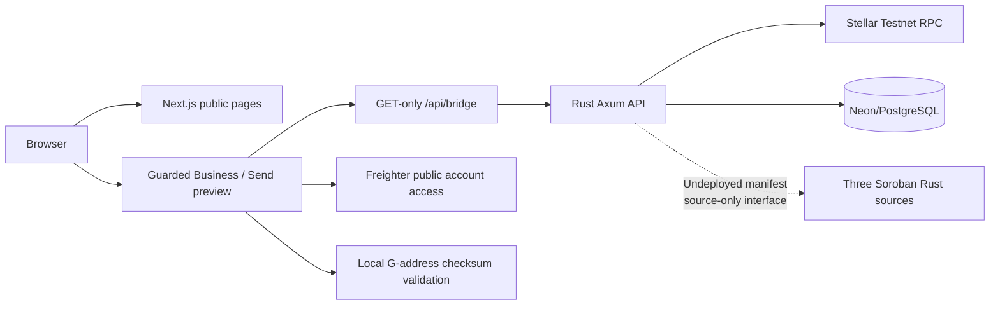

# Frontend Architecture and Delivery Plan

> Scope: Next.js product and developer-preview experience on Stellar Testnet. A CI-green site is not evidence of live payments. No wallet signing, real funds or fiat transfers are enabled.

## Product shape

The repository supports three related but different user experiences:

| Experience | Current mode | Planned destination |
| --- | --- | --- |
| **Public site** | Landing, Business, Send and Platform stories, SEO and responsive navigation | Customer education, clear risk/privacy disclosures, eligibility entry points and developer documentation |
| **Business preview** | Read-only ledger, eligible corridor records, contract source status, optional public wallet view | Authenticated treasury operations, entity/role selection, dual approvals, quote review, settlement monitoring, reconciliation |
| **Send preview** | Read-only network health, real configured corridors, watch-only address, transfer disabled | User-led remittance eligibility, priced quote, explicit privacy disclosures, wallet-authorized Testnet settlement, receipt and recovery |

The default `STEALTHBRIDGE_SITE_MODE=landing` stays independent of the backend. Preview routes are isolated behind `STEALTHBRIDGE_SITE_MODE=preview` for engineering/staging; they are **not** production payment flows. The two product journeys must not share a misleading universal "Send" button.

## Runtime topology

The server-side proxy explicitly allowlists routes and limits query parameters, destination protocols, upstream response size, redirects and request duration. The browser does not receive PostgreSQL or RPC provider credentials. It never signs or posts settlements through the preview.

## Code ownership and contracts

- `src/app/(...)` public pages: product and marketing copy must describe planned financial capabilities accurately.
- `src/components/workspace.tsx` + `src/hooks/use-bridge.ts`: status, request lifecycle, AbortController, paginated enabled corridor catalog, disabled financial actions and honest error states.
- `src/app/api/bridge/[...parts]/route.ts`: server-only allowlisted GET proxy; no wallet or payout POST path.
- `src/components/wallet-connect.tsx`: user-initiated Freighter public-account access, Testnet passphrase checks, focus/account-change invalidation and optional local watch-only display.
- `src/lib/stellar-address.ts`: checksum-valid classic Stellar G-address decoding. **Public address ≠ ownership, identity, membership or signing authority.**
- `src/lib/public-soroban-interface.v1.json` + `scripts/verify-soroban-interface.mjs`: exact source-only three-contract ABI snapshot and CI parity against a pinned contracts revision.
- `src/lib/bridge-api.ts`: reject unsupported upstream payment capability flags, unverified contract claims, and ABI differences.

**Future package integration:** consume a pinned, published `@stealthbridge/sdk` rather than keeping duplicate runtime models; preserve the same site-safe read-only route boundary. Do not import Node-specific or secret-bearing modules into client components.

## Wallet journey and security states

A future wallet subsystem needs distinct states: **disconnected → permission requested → local account connected → Testnet RPC corroborated → authenticated organization session → transaction reviewed → signer approved/rejected → independently verified chain result**.

Currently, only the public-account and network-read portions exist. Watching a pasted address is explicitly labeled **watch-only**. Connecting Freighter does not establish authentication and cannot trigger a transfer. Before any new action, re-evaluate account, network, privacy disclosure, permissions and reviewed transaction footprint. Store no seed phrase, recovery phrase, secret key, encrypted note or confidential witness in application logs.

For an eventual signed organization login, rely on backend-issued nonces bound to origin, network, expiry and audience, with replay protection and active tenant-scoped membership. Never treat a `G...` string sent in a request as proof of authentication.

## Target Business information architecture

1. Organization chooser and role-aware dashboard with real tenant-scoped values only.
2. Corridors and assets, with issuer/contract verification, limits, eligibility and live source timestamps.
3. Quote review: asset-in/out, exact units, expiry, fees, FX rate source, counterparty disclosure and risk.
4. Settlement drafts, distinct-approver queue, contract authorization footprint and wallet-confirmation surface.
5. On-chain finality view separate from off-chain partner payout, reconciliation differences, exceptions and refunds.
6. Audit trail and export with privacy/least-privilege rules.

## Target Send information architecture

1. Location/asset eligibility; no unsupported countries or partners.
2. Quote and fee disclosure, recipient and privacy mode explanation.
3. Wallet connect and user-reviewed funding/signing.
4. Privacy proof/note creation and recipient recovery **only after actual protocol feasibility and audit**.
5. Payout and receipt lifecycle with chain vs provider status clearly separated, including cancellation/failure states.

Confidential amounts and relationship privacy are different security models; do not promise one because the other is being researched.

## Delivery milestones

| Milestone | Work | Acceptance evidence |
| --- | --- | --- |
| F1 — Reliable Testnet read UX | Network, readiness, corridor, contract source and transaction observation; explicit empty/error/stale states | Browser + API smoke tests, independently checked staging runtime |
| F2 — Consistent developer integration | Published/pinned SDK version, generated OpenAPI types and ABI parity, correlated error codes | SDK fixture build and browser E2E parity; no unsafe imports |
| F3 — Wallet/session authorization | Nonce-bound challenge login, account-change cancellation, organization roles | Forgery/replay tests, permission/revocation tests, keyboard/screen-reader audit |
| F4 — Contract-read experience | Only verified deployed IDs and on-chain reads, with source/bytecode provenance | Independent Testnet attestations, immutable gate display, deployment rollback |
| F5 — Financial UX | Explicit quote/approval/signature/proof/chain/provider/reconciliation steps | Approved audited rail, real Testnet evidence, adversarial tests and incident/recovery runbooks |

## Quality, accessibility, and operations

- Mobile-first layout; WCAG 2.2 AA-oriented keyboard traversal, focus, accessible errors and reduced motion.
- No misleading success animation, demo FX quotation, balances, liquidity, partner, privacy guarantee or paid-out status.
- Prefer skeleton/empty/degraded patterns over invented placeholder records; show source timestamp and stale data.
- Limit external-link prefetches for addresses; public Testnet explorer is opt-in and discloses the address to the explorer.
- The preview smoke suite exercises Postgres and Stellar freshness; CI mocks are **test fixtures**, never production data.
- Security regression list: SSRF redirect, GET-only proxy, forged ABI, wrong network, wallet disconnect, stale ledger, sensitive-data leakage, responsive buttons and a11y.

## Where to read and what to change next

- [Wallet model](WALLET-INTEGRATION.md) · [Deployment and smoke](DEPLOYMENT.md) · [Design system](DESIGN-SYSTEM.md) · [Product flows](PRODUCT-FLOWS.md)
- [Repo roadmap](../ROADMAP.md) · [Organization architecture](https://github.com/stealthbridge-labs/.github/blob/main/docs/PLATFORM-VISION-AND-ARCHITECTURE.md)
- Before merging a feature that crosses repositories, update the backend OpenAPI, SDK validator, canonical contract source interface and E2E tests together.

**Definition of done:** correct runtime behavior, negative tests, accessible states, no unauthorized financial action, linked evidence, and explicit release blockers.
